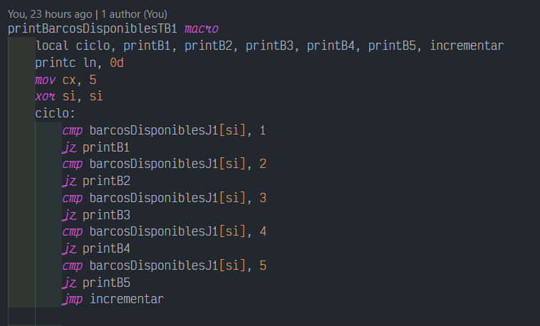
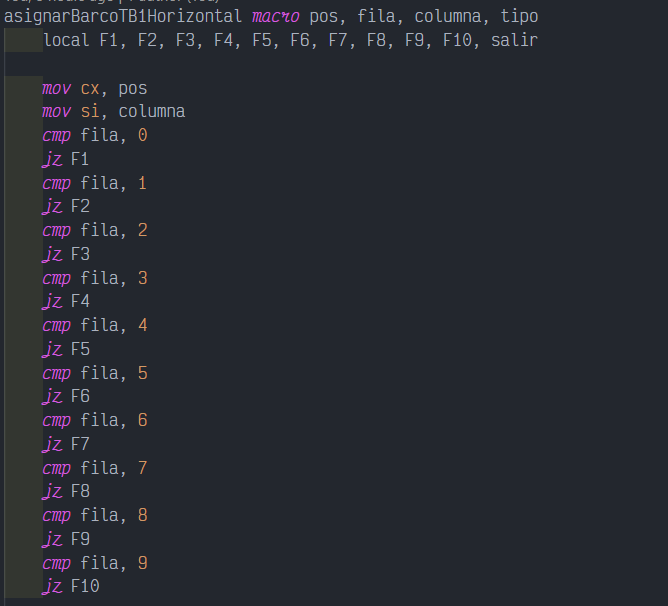

# Práctica 3 - Manual Técnico

## Arquitecutra de Computadores y Ensambladores 1 Sección A
| Nombre                           | Carné                                      |
|:--------------------------------:|:------------------------------------------:|
| Daniel Reginaldo Dubón Rodríguez | 201901772                                  |

## ASSEMBLER

Ensamblador es un lenguaje de programacion de bajo nivel
consiste en un conjunto de mnemonicos que representan
instrucciones basicas para los procesadores,
microprocesadores, microcontroladores y otros circuitos
integrados programables.
Su implementacion es mediante la representacion simbolica de
los codigos binarios de maquina estos se usan para programar
la arquitectura del procesador.
El lenguaje assembly tiene la representacion mas directa del
codigo maquina especifico para cada arquitectura, que puede ser
legible por un programador.

## DOSBOX

DOSBox es un emulador que recrea un entorno similar al sistema DOS con el
objetivo de poder ejecutar programas y videojuegos originalmente escritos para el
sistema operativo MS-DOS de Microsoft en computadoras más modernas o en
diferentes arquitecturas.
DOSBox es un emulador de CPU completo, no solo una capa de compatibilidad
como DOSEmu o las máquinas con DOS virtual de Windows y OS/2, que
aprovechan las posibilidades de virtualización de la familia de procesadores Intel
80386. No requiere un procesador x86 ni una copia de MS-DOS o cualquier otro
DOS para ejecutarse, y puede ejecutar juegos que requieran que la CPU esté en
modo real o modo protegido.

 

## CODIGO Y MACROS UTILIZADOS

### Variables
Aca en esta se declararon las variables de texto que sirven para mostrar los diferentes mensajes de texto en pantalla

 

En esta area se declaron las variables de tipo numerico que serviran para hacer operaciones aritmeticas y tambien se encuentran las variables que simulan filas que unidas representan una matriz de 10x10

 

### Menu

Se muestra la logica implementada para la creacion del menu principal, dependiendo de que tecla se presione, ejecutara alguna de las opciones seleccionadas

 

## MACROS

### pritnc

Hace posible imprimir un texto en pantalla con un color especificado

 

### printn

Permite imprimir un numero de dos cifras en pantalla

 

### cls

Permite limpiar la pantalla

 

### getch

Permite el ingreso de un caracter a traves del teclado

 

### imprimitTB

Permite imprimpir un tablero espeficicado

 

### printRow

Permite imprimir una Fila de un tablero especificado

 

### printBarcosDiponibles

Permite visualizar la lista de barcos que aun estan diposnibles para su colocación 

 

### llenandoTB

Permite llenar un tablero con los diferentes barcos en diferentes posiciones

 

### getch2

Permite el ingreso de texto de 2 caracteres

 

### asignarBarco

Permite insertar un tipo de barco en una posicion especificada

 

### asignarBarcoH

Permite insertar un barco en el tablero de forma horizontal

 

### asignarBarcoV

Perimte insertar un barco en el tablero de forma vertical

 

### verificarPos

Permite verificar si se puede insertar un barco para que este no haya un tipo de traslape

 