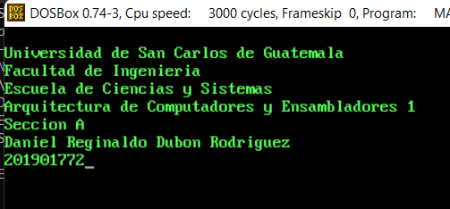
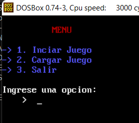
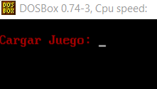
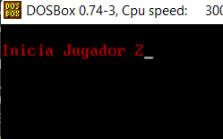
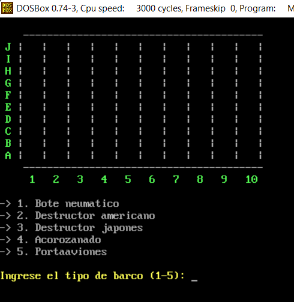
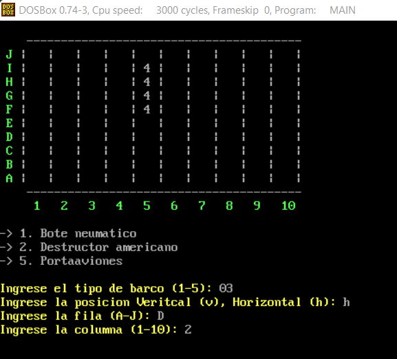
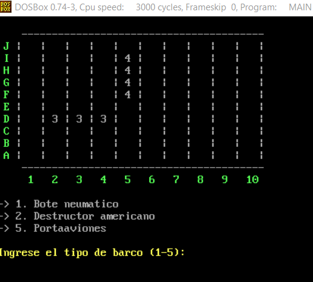
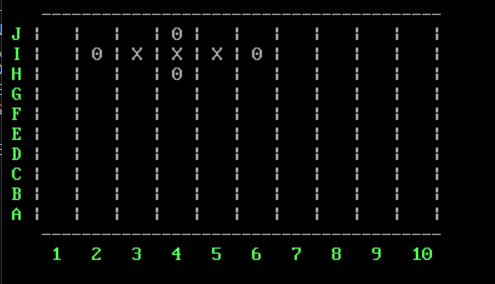

# Práctica 3 - Manual de Usuario

## Arquitecutra de Computadores y Ensambladores 1 Sección A
| Nombre                           | Carné                                      |
|:--------------------------------:|:------------------------------------------:|
| Daniel Reginaldo Dubón Rodríguez | 201901772                                  |

## INTRODUCCIÓN

Se el juego de batleship en el lenguaje de programacion de bajo nivel Assembler, haciendo uso del emulador DosBox con el macro del lenguaje Assembler MASM v6.11               				

## Funciones de la Aplicación
- Mensaje de Bienvenida
- Iniciar Juego
- Guardar Juego
- Generar reporte de estado del Juego
- Cargar Juego
- Salir

## Mensaje Inicial

Cada vez que inicia el juego se muestra la informacion del desarrollador, solo se podra pasar de este mensaje tocando la tecla enter

 

### Menu Principal

Muestra las diferentes opciones del juego

 

- **Iniciar Juego :** Al escoger esta opción se procederá a realizar el sorteo del jugador que iniciará el juego, el 
cual se realizará por un método aleatorio y el resultado debe ser visible en pantalla y avanzar 
únicamente al presionar la tecla Enter, luego se procederá a mostrar el tablero del jugador en 
turno. Este tablero debe mostrar el jugador que está en turno, en la cuadricula superior los 
disparos, en la cuadricula inferior los barcos y debe de tener una entrada para el ingreso de 
instrucciones.

- **Cargar Juego :** Permitirá el ingreso de la ruta para el nombre del archivo que contiene el juego guardado 
previamente; luego mostrara el tablero de juego con la representación del almacenamiento 
anterior.
Al cargar el juego debe de ser posible recuperar la posición de los barcos y los disparos de 
cada jugador, el jugador en turno y continuar el juego desde el punto guardado.

 

- **Salir :** esta opción cerrará la aplicación.

### Mecanica del juego

Al iniciarse el juego se hara un sorteo aleatorio sobre que jugador empezara con el primer turno.

 

 

Despues se esplegara el tablero de juego con la opción de ingresar los barcos de cada jugador, se deben
ingresar los 5 barcos en un mismo turno. Esto se hará solicitando el id del barco que se desea 
ingresar, al ser registrado el id, deberá de mostrarse un mensaje indicando el barco que se está 
ingresando y solicitando la dirección en la que se colocara, también debe mostrarse el listado 
de barcos disponibles para su siguiente ingresó al tablero, en esta parte únicamente se 
mostrará la cuadrícula inferior. El estudiante debe validar que el barco que se está colocando 
no quede sobre un barco que ya se encuentre colocado

 

Ingreso de coorenadas de un barco

 

 

Despues de que al terminar de ingresar ambos jugadores los barcos empezará el juego, se deberá mostrar un 
mensaje como el de identificación indicando que dará inicio el juego esperando que el usuario 
presione la tecla enter para poder avanzar. Al avanzar se mostraran ahora las 2 cuadrículas del 
jugador con el primer turno, por cada turno se le solicitará a los jugadores las coordenadas 
donde quieran realizar el disparo, siendo estas solicitadas por separado al usuario, al ingresar 
las dos coordenadas se deberá mostrar un mensaje de confirmación al usuario, si se decide 
proceder se realizara el disparo y si no se da la opcion de volver a pedir las coordenadas del 
mismo, cada vez que se realice un disparo se debe verificar que no se ha disparado en esa 
posición con anterioridad. Si el disparo impacta en un barco enemigo se deberá marcar la 
casilla en la cuadrícula superior con un a x, si no impacta se debe marcar con una o.

 

Esto 
ayudará a los jugadores a saber las posiciones en las que se ha disparado y con que disparos 
ha impactado barcos, para verificar si el disparo se realizo debe refrescar el contenido del 
tablero, como mostrando una vista previa de lo que paso en ese turno, luego esperara a que se 
presione la tecla enter para pasar al siguiente turno. Si un barco es impactado en alguna 
posicion debe ser marcado con una “x” en la posicion donde fue impactado. En cada turno 
debe mostrarse la cantidad de barcos disponibles tanto del adversario como los propios de 
cada jugador, la cual debe actualizarse al derribar algun barco.

## Fin del juego

El juego acabara hasta que uno de los dos jugadores derribe todos los barcos de su adversario

## Comandos dentro del juego
- **GUARDAR :** este comando servirá para guardar el estado actual del juego, el proceso de 
guardado será el siguiente:
  1. Preguntar el nombre del archivo a guardar.
  2. Mostrar el estado de guardado (éxito o fracaso).
  3. Esperar a que se presione la tecla enter para continuar.
  4. Volver a mostrar el tablero sin modificar el turno del jugador para poder continuar con el 
juego.
- **SALIR :** este comando dará la oportunidad a los jugadores de salir del juego sin importar el 
estado actual del mismo.

- **SHOWHTM :**: este comando generará un archivo con extensión “.HTM”, en el cual se va a 
plasmar en el estado actual del juego, unicamente del jugador que ingreso el comando, 
también deberá mostrarse el total de disparos que se han hecho hasta el momento, mostrando 
cuantos son los que se han acertado y cuantos se han fallado. Este debe mostrarse en el 
navegador del equipo que esté corriendo el emulador DOSBOX, este archivo se abrirá 
manualmente y dentro de la carpeta de desarrollo debe existir únicamente un archivo con esta 
extensión.